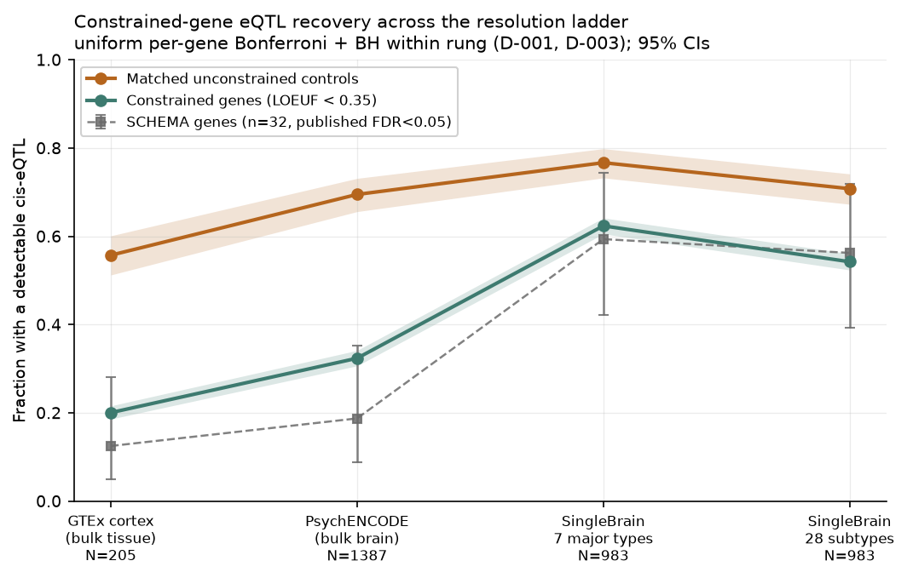
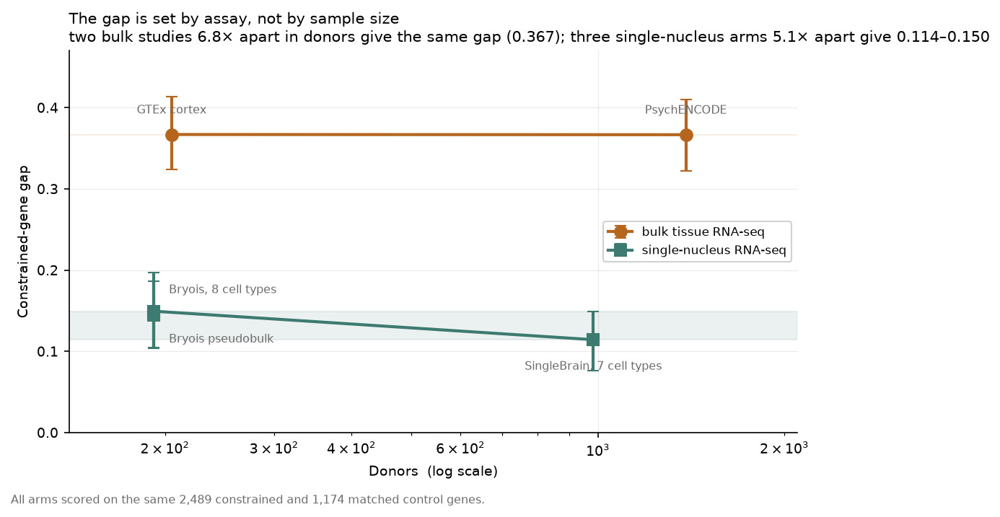

# The Missing Regulation Ladder

**Does the shortage of cis-eQTLs at schizophrenia risk genes reflect natural
selection, or just insufficient resolution and power?**

This repository tests one question: as brain expression data is resolved from
bulk tissue down to single-nucleus cell subtypes, do the "missing" cis-eQTLs at
constrained and SCHEMA schizophrenia genes reappear — and how much of the gap
closes?

It is a re-analysis of published summary statistics only. No genotype-level
data, no wet lab.

## Result so far



Going from bulk cortex to single-nucleus major cell types closes **59.9%
[49.5%, 70.5%]** of the constrained-gene eQTL gap. The residual 40% does not
close, and closure spans 47.9%–59.9% across every structural variant tested.

**And the cause is neither of the two hypotheses this project set out to
adjudicate.** All three candidate explanations were tested directly:

| Explanation | Test | Verdict |
|---|---|---|
| Donor count (the power account) | ×6.8 donors within bulk tissue | **excluded** — gap unchanged |
| Cell-type resolution | splitting *and* pooling, two studies | **excluded** — bounded ≤10% |
| **Assay: nuclei vs whole tissue** | bulk vs snRNA-seq, matched genes | **survives** |



Two bulk studies **6.8× apart in donors** give the same gap to three decimal
places (0.367). Three single-nucleus arms **5.1× apart in donors** give
0.114–0.150. The sharpest single comparison: **Bryois pseudobulk**, 192 donors,
gap **0.144** — against **PsychENCODE** bulk tissue, **1,387 donors**, gap
**0.367**.

So ~60% of the constrained-gene deficit is a property of **bulk tissue
RNA-seq** that single-nucleus RNA-seq does not share; the residual ~40%
survives every assay, resolution and sample size tested, and is the part
consistent with selection. See
[`docs/stage1_report.md`](docs/stage1_report.md) §4.

---

## The disagreement being adjudicated

Two published accounts explain the same observation — that the genes GWAS most
implicates are the genes eQTL studies are worst at finding regulatory variants
for — in incompatible ways.

**H1 — the selection account** (Mostafavi, Spence, Naqvi & Pritchard, *Nature
Genetics* 2023). cis-eQTLs are genuinely depleted near constrained genes.
Selection removes common regulatory variants of large effect at genes where
dosage matters, leaving a regulatory landscape that is real, distributed and
largely invisible to eQTL mapping. On this account the gap is a biological
fact, not a measurement problem, and it should **persist at any resolution**.

**H2 — the power/resolution account** (Rosen, Broadaway, Brotman, Mohlke &
Love, *AJHG* 2026; bioRxiv 2025.08.05.668745). The gap is substantially an
artefact of statistical power. Larger eQTL studies find weaker eQTLs, and those
weaker eQTLs look progressively more "GWAS-like" — more distal, more
enhancer-overlapping, higher pLI. On this account the gap is a measurement
problem and it should **shrink as resolution and power increase**.

Note that Rosen et al. explicitly frame their result as consistent with
Mostafavi's signal-discovery model rather than as a refutation of it. This
project is designed to estimate *how much* of the gap each account explains,
not to crown a winner. See "What this project will not claim" below.

## Pre-registered predictions

The ladder has four rungs of increasing cellular resolution:

| Rung | Data | Resolution |
|---|---|---|
| 1 | GTEx v10 brain (cortex) | bulk, single tissue |
| 2 | PsychENCODE adult prefrontal cortex | bulk, meta-analysed brain |
| 3 | SingleBrain, 7 major neocortical cell types | single-nucleus, major types |
| 4 | SingleBrain, 28 cell subtypes | single-nucleus, subtypes |

The outcome measure is the **recovery fraction**: the proportion of
constrained/SCHEMA genes with a detectable cis-eQTL at a given rung, against a
matched unconstrained control set, stratified by LOEUF decile, reported with
confidence intervals.

The quantity of interest is the **gap** — the difference between the control
curve and the constrained curve at each rung.

**If H1 (selection) is right:** the gap stays roughly flat across rungs. Both
curves may rise as power increases, but constrained genes do not catch up.
Residual depletion at subtype resolution is the signature.

**If H2 (power/resolution) is right:** the gap narrows monotonically with rung,
and constrained-gene recovery at rung 4 approaches the control level — the
pattern FastGxC reports in blood, where context-specific eGenes' constraint
depletion weakens toward GWAS constraint levels.

**The likely real answer, stated in advance:** partial closure. The
decision-oriented output is a decomposition — "single-nucleus resolution closes
X% of the constrained-gene gap; the residual Y% is consistent with selection" —
with a confidence interval on X.

**What would make the result uninterpretable** (also stated in advance): if
recovery tracks each study's donor count rather than its resolution. That
confound is the project's main known risk and is addressed directly below.

## The power confound, and how far it can be tested

The four rungs differ in sample size, ancestry composition, normalisation and
eQTL-calling pipeline as well as in resolution. Any naive reading of the
recovery curve therefore partly measures power, which is Rosen's point rather
than a test of it.

Four mitigations are built in:

1. Every recovery estimate is reported against the donor N of its rung, never
   against rung index alone.
2. **Splitting cell classes into their own subtypes** within SingleBrain —
   same donors, same nuclei, same pipeline, only the grouping changes. Run in
   Stage 1: the gap moves by -0.007 [-0.021, +0.005], bounding resolution at
   at most ~10% of the observed closure.
3. Bryois et al. 2022 enters as a **within-assay power contrast**, not as a
   rung: single-nucleus like SingleBrain but at a much smaller donor count.
4. **The Bryois pseudobulk arm.** The February 2023 update to that Zenodo
   record added `pb[1-22].gz` — a "tissue-like" analysis pooling all nuclei per
   individual, from the same donors and pipeline as the eight cell-type files.

**A limitation discovered in Stage 1, worth stating plainly:** none of these
isolates resolution cleanly, and probably nothing can. In single-cell data,
resolution and per-context power are *intrinsically coupled* — at fixed
sequencing depth you cannot resolve more contexts without putting fewer reads
in each. Splitting (2) loses reads per context; pooling (4) gains them. The two
vary resolution in opposite directions, so agreement between them brackets the
answer even though neither isolates it.

The headline framing is therefore "resolution-plus-power", and the honest
statement of scope is that public summary statistics can bound the split
between the two but cannot fully resolve it.

## What this project will not claim

- Not a winner-take-all verdict. The accounts are complementary; the output is
  a decomposition with uncertainty, not a binary.
- Not a causal claim from colocalization alone.
- Not a claim that any number from a preprint is settled. Rosen et al. 2026 and
  the November 2025 brain/blood single-nucleus preprint have not completed peer
  review; anywhere a specific number from either is load-bearing is flagged
  inline in the methods note.

---

## Data sources

| Dataset | Use | Licence | Redistributable |
|---|---|---|---|
| [gnomAD v2.1.1 constraint](https://gnomad.broadinstitute.org/downloads) — Karczewski et al. 2020, *Nature* 581:434–443 | LOEUF/pLI, matching covariates | gnomAD terms | Yes |
| [gnomAD v4.1 constraint](https://gnomad.broadinstitute.org/downloads) — Chen et al. 2024, *Nature* 625:92–100 | robustness check | gnomAD terms | Yes |
| [SCHEMA browser](https://schema.broadinstitute.org/) — release 2026-08-21 | SCHEMA set, sensitivity arm | browser terms | Yes |
| [Singh et al. 2022 Supp. Table 5](https://doi.org/10.1038/s41586-022-04556-w) — *Nature* 604:509–516 | SCHEMA set, **primary** | publisher supplementary | **No** |
| [GTEx v10](https://gtexportal.org/home/downloads/adult-gtex/qtl) | rung 1 | open access | Yes |
| [PsychENCODE](http://resource.psychencode.org/) — Wang et al. 2018, *Science* 362:eaat8464 | rung 2 | under review | **No** (pending) |
| [MetaBrain](https://www.metabrain.nl/) — de Klein et al. 2023, *Nature Genetics* 55:377–388 | rung 2 (blocked) | registration form | **No** |
| [SingleBrain](https://doi.org/10.5281/zenodo.14908182) — Jang et al. 2026, *Nature Genetics* 58(4):737–747 | rungs 3–4 | CC-BY-4.0 | Yes |
| [Bryois](https://doi.org/10.5281/zenodo.7276971) — Bryois et al. 2022, *Nature Neuroscience* 25:1104–1112 | power contrast + pseudobulk arm | CC-BY-4.0 | Yes |
| [PGC3 SCZ GWAS](https://pgc.unc.edu/for-researchers/download-results/) — Trubetskoy et al. 2022, *Nature* 604:502–508 | Stage 2 colocalization | PGC data-use agreement | **No** |

Methods and framing also draw on: Mostafavi, Spence, Naqvi & Pritchard 2023
(*Nature Genetics*); Rosen et al. 2026 (*AJHG*; bioRxiv 2025.08.05.668745);
FastGxC (*Cell Genomics* 2026); OneK1K/CIGMA (*Nature* 2026).

Datasets whose licence does not permit rehosting are written to
`data/restricted/`, which `.gitignore` excludes as a whole directory. Only
derived outputs — recovery curves, summary tables — are published from them.

## Reproducibility

- `uv sync` then `uv run python scripts/run_all.py` reproduces every table and
  figure from the raw downloads in about 70 seconds. `--from sNN` resumes.
- Dependencies pinned in `uv.lock`; `requirements.txt` is the deploy floor.
- `RANDOM_SEED` in `pipeline/config.py` seeds every sampling and gene-matching
  step.
- Every download is stamped with its URL, UTC date, byte count and sha256 in
  `logs/provenance.json`. A file whose hash stops matching its record raises
  rather than being silently re-fetched.
- Methodological choices are logged in `DECISIONS.md` and, machine-readably, in
  `logs/decisions.jsonl`.

## Layout

```
pipeline/     config, sources, downloads, provenance, decisions, sNN stages
scripts/      run_all.py -- runs every stage in dependency order
app/          Streamlit dashboard (Stage 3)
data/raw/     redistributable downloads
data/restricted/   licence-restricted downloads, never committed
data/processed/    derived tables the dashboard reads
docs/         stage reports, figures, methods note
logs/         downloads.json (which bytes), decisions.jsonl (which choices),
              sNN_*.json (gene loss per stage)
```

## Read next

| Document | What it is |
|---|---|
| [**Methods note**](docs/methods_note.md) | 2–3 page write-up, bioRxiv style — the headline finding and how it was reached |
| [Interview Q&A](docs/interview_qa.md) | Anticipated questions with answers grounded in the results, including what went wrong |
| [`DECISIONS.md`](DECISIONS.md) | Every methodological choice, its alternatives, and why — 14 entries |
| [Stage 0](docs/stage0_report.md) · [Stage 1](docs/stage1_report.md) · [Stage 2](docs/stage2_report.md) | Stage reports with full numbers |
| [Deploying the dashboard](docs/deploy.md) | Streamlit Community Cloud steps |

Run the dashboard locally:

```bash
uv sync && uv run streamlit run app/streamlit_app.py
```

Reproduce every table and figure from the raw downloads (~70 s):

```bash
uv run python scripts/run_all.py
```

## Status

**Stages 0–4 complete.** All four rungs built, both hypotheses tested and
excluded, causal and druggability layers run, dashboard built and tested.

| Stage | Output |
|---|---|
| 0 — scope lock | 18,481-gene universe, 2,767 matched pairs, rung audit, 254 files hash-stamped |
| 1 — recovery curve | 59.9% [49.5, 70.5] closure; assay identified as the cause |
| 2 — causal + druggable | 184 loci, 41 gained at single-nucleus, 24 clinical targets, CHRM4 answered |
| 3 — ship | 5-page dashboard, methods note, licence audit |
| 4 — interview prep | Q&A grounded in the results |

**Not yet done:** deployment to Streamlit Community Cloud (needs authorising
from the owner's account — see [docs/deploy.md](docs/deploy.md)), and the
HEIDI/coloc sensitivity arms for Stage 2.

## Related work

This is the third project in one line of work on schizophrenia genetics, and it
is deliberately the one that asks a question rather than builds a ranking.

- **[celltype-enrichment](https://github.com/itsslightning/celltype-enrichment)**
  — cell-type enrichment of schizophrenia vs Alzheimer's common-variant
  heritability (MAGMA, MAGMA.Celltyping, EWCE). Establishes *which brain cell
  types* carry schizophrenia heritability.
- **[scz-target-prioritization](https://github.com/itsslightning/scz-target-prioritization)**
  — ranks GWAS genes on association, druggability and cell-type specificity
  together. Establishes *which genes* are worth pursuing, and surfaced CHRM4 at
  rank 7 before Cobenfy's approval made the muscarinic mechanism obvious.
- **This repo** — asks why the regulatory evidence for those genes is missing in
  the first place, and whether it is missing because of biology or because of
  measurement.

The three share conventions on purpose: `pipeline/provenance.py` (gene-loss
accounting) is carried over unchanged from `scz-target-prioritization`, the
`pipeline/` → `data/processed/` → `app/` layout is the same, and both dashboards
read only what the pipeline already wrote. What is new here is
`pipeline/decisions.py`, which holds conclusion-shaping choices as sentinels
that refuse to default.
